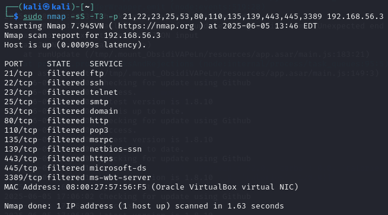

## Goal:

Detect port scanning by parsing logs and trigger `nftables` to block the source IP and create a cron job to automate this response. Show alternative method of port scan detection and response using `Fail2Ban`.

## Setup:

- Kali Linux 2024.3 virtual machine (Attacker)
- Ubuntu 24.04.2 LTS virtual machine (Target)
- VirtualBox Host-Only Network: `192.168.56.1/24`

## Attack:

I will be focusing on detecting SYN scans `-sS`, where the attacking machine will not complete the TCP handshake, instead sending a RST packet in response to the SYN-ACK packet sent from any open ports. 

I will be using T3 (Normal) Nmap timing `-T3`, behavior-based IDS is often needed to detect T0-T2 level scans.

I will also specify commonly used ports while scanning `-p`, which should be plenty to trigger detection of the scan.

`nmap -sS -T3 -p 21,22,23,25,53,80,110,135,139,443,445,3389 192.168.56.3`

## Manual Detection:

In order for port scanning to be detectable in logs, an `nftables` rule needs to be created. On the target Ubuntu machine, I used the below command to create a logging rule for incoming SYN scans.

`sudo nft add rule ip filter INPUT tcp flags syn log prefix "SYN_SCAN_ATTEMPT--"`

Next I performed the SYN scan from Kali on 12 common ports:


Checking `/var/log/syslog` confirmed that the logging rule works, showing 12 log entries with the `"SYN_SCAN_ATTEMPT"` prefix and the port number that was scanned.


## Detection & Blocking with Script and Cron Job

I created a Python script that will check syslog for this prefix and determine if an IP is making too many SYN scans and if so, will block the IP using `nftables`.

The script will keep a text file list of IPs that have been blocked to avoid trying to ban them multiple times:

```
def main():
    # Open or create a file to keep track of blocked IPs
    try:
        with open(BLOCKED_IPS_FILE, 'r') as file:
            already_blocked = set(line.strip() for line in file)
    except FileNotFoundError:
        already_blocked = set()
    
    # Parse logs and return any IPs conducting too many port scans
    ips_to_block = parse_logs()

    # Block the malicious IP addresses and write them to the blocked IPs file
    with open(BLOCKED_IPS_FILE, 'a') as file:
        for ip in ips_to_block:
            if ip not in already_blocked:
                block_ip(ip)
                file.write(f"{ip}\n")
```

The next part of the script will extract timestamps and IPs from syslog and identify IP addresses than have performed more than a set threshold (10) of SYN scans in the past minute, since I plan to run this as a cron job each minute. 

```
def count_recent_syns(ip_logs):
    ips_to_block = set()

    for ip, timestamps in ip_logs.items():
        # Count log entries from unique IPs in the chosen timeframe 
        count = 0
        
        for timestamp in timestamps: 
            timestamp = datetime.fromisoformat(timestamp.split("+")[0])
            
            if (datetime.now() - timestamp).total_seconds() <= SCAN_TIMEFRAME:
                count += 1
        # Add IP to block list if count has reached the chosen threshold
        if count >= SCAN_THRESHOLD:
            ips_to_block.add(ip)
            
    return ips_to_block

def parse_logs():
    ip_logs = defaultdict(list)

    # Search entries of syslog for the SYS_SCAN_ATTEMPTS-- prefix
    with open(LOG_FILE, 'r') as file:
        for line in file:
            if LOG_PREFIX in line:
                # Add source IPs of each SYN scan log 
                for part in line.split():
                    if part.startswith("SRC="):
                        ip = part.split("=")[1]
                        # Add each timestamp of log entries from that IP to ip_logs defualtdict
                        ip_logs[ip].append(line.split()[0])
    
    return count_recent_syns(ip_logs)
```

These timing and threshold values can be altered in the defined constants:

```
BLOCKED_IPS_FILE = "blocked_ips.txt"
LOG_FILE = "/var/log/syslog"
LOG_PREFIX = "SYN_SCAN_ATTEMPT--"
SCAN_THRESHOLD = 10
SCAN_TIMEFRAME = 60
```

In order for the script to run commands to block the IP addresses, `nftables` needs to be set up to hold a list of IPs and drop traffic from the ones added to the `blocked_ips` set.

```
sudo nft add set ip filter blocked_ips '{ type ipv4_addr; flags interval; }'
sudo nft add rule ip filter input ip saddr @blocked_ips drop
```

Running `sudo nft list ruleset` should show the ip filter table similar to this:


My script then uses subprocess to run the command to add each ip to the blocked_ips set:

```
def block_ip(ip):
    # Block the IP with nftables
    cmd = ["sudo", "nft", "add", "element", "ip", "filter", "blocked_ips", f"{{ {ip} }}"]
    subprocess.run(cmd)
```

I ran another nmap scan and ran the below command to show all IPs that have been blocked. :

`sudo nft list set ip filter blocked_ips`


This will match the IP kept in `blocked-ips.txt`


I hardcoded '1.3.4.3' to check that multiple IPs would be added, `192.168.56.4` is my Kali IP that was blocked after the nmap scan. Attempting to scan again returns all ports as 'filtered', implying the scans are being blocked with by a firewall.



The following command can be used to unban an IP:

`sudo nft delete element ip filter blocked_ips { 1.2.3.4 }`

## Running with Cron

The command `crontab -e` is used to set the script to run with cron by adding the following line. This will run the script every minute and write print output and debugging info to a file called scan_debug.log.

`* * * * * /path/to/port-scan-detection.py >> /home/ubuntu/scan_debug.log 2>&1`

Since the command to add IPs to `nftables` uses sudo, I had to allow the `nft` command to be run without a password. This not a huge security concern since the script uses an array-style subprocess command and does not involve a shell or allow a user to inject their own commands, as shown below:

`cmd = ["sudo", "nft", "add", "element", "ip", "filter", "blocked_ips", f"{{ {ip} }}"]`

Allowing nft to run witout a password can be done with the command `sudo visudo` and adding the line:

`[USERNAME] ALL=(ALL) NOPASSWD: /usr/sbin/nft`
