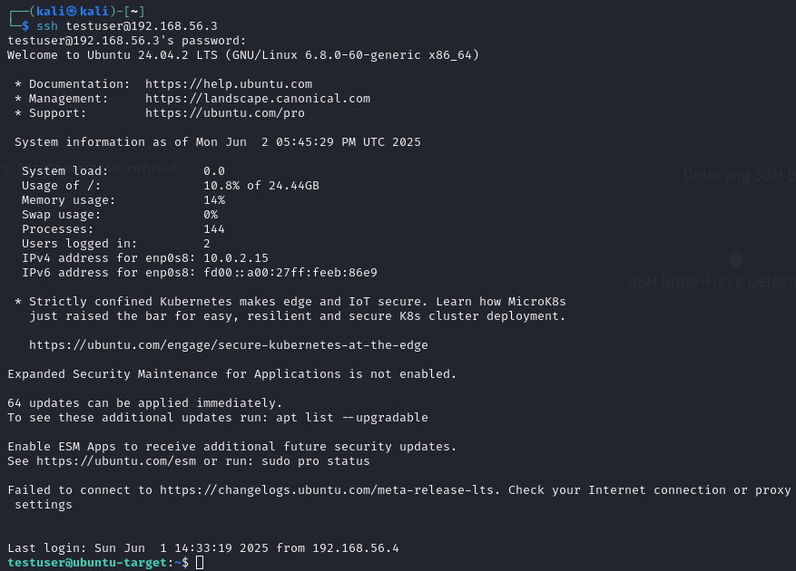

## Goal:

Simulate an SSH brute-force attack using Hydra from Kali Linux, log and block the attack on a target Ubuntu SSH server using Fail2Ban.

## Setup:

- Kali Linux 2024.3 virtual machine (Attacker)
- Ubuntu 24.04.2 LTS virtual machine (Target)
- OpenSSH server installed on Ubuntu
- VirtualBox Host-Only Network: `192.168.56.1/24`

## OpenSSH Setup:

Install the SSH Server:

`sudo apt update && sudo apt install openssh-server -y`

Enable and start SSH:

```
sudo systemctl enable ssh
sudo systemctl start ssh
```

Ensure SSH is enabled and actively running:

`sudo systemctl status ssh`


Add a test user:

```
sudo adduser testuser
# Password set as 'dragon'
```

## Attack:

**Tools:** Hydra

A port scan of target confirms SSH is running on port 22.

`nmap -p 22 192.168.56.3`


I created a small wordlist of 15 common passwords for this attack, since the goal will be to detect an unusual amount of failed logins within a short period of time.


In this scenario the attacker already has knowledge of the username `testuser`. The below hydra command is used to brute-force attempt ssh logins with the passwords in the above wordlist.

`hydra -l testuser -P /home/kali/wordlists/passwords-ssh-15.txt ssh://192.168.56.3`


Without Fail2Ban set up, hydra successfully found the user's password: `dragon` and allows us to log on to the Ubuntu server.



## Log Detection:

These failed log in attempts can be detected in the file `/var/log/auth.log` and grep can be used to search specifically for failed login attempts:

`grep --text "Failed password" /var/log/auth.log`


We will configure Fail2Ban to watch this log for indications of a brute force attack.

## Fail2Ban Setup:

Fail2Ban's detection rules can be configured in a local copy of the jail.conf file. This is accomplished by setting values like maximum failed log in attempts, the time frame in which that amount would be considered ban worthy, and the amount of time to ban the IP from which the attempts came. The path to the log file mentioned above will also be set in this file.

The following command will copy this config file to a local file to edit these values:

```
sudo cp /etc/fail2ban/jail.conf /etc/fail2ban/jail.local
sudo nano /etc/fail2ban/jail.local
```

For this test, I configured IPs to be banned for 20 minutes if 5 failed attempts happen from the same IP within 2 minutes.


I ran the hydra command again from Kali. Inspecting `/var/log/fail2ban.log` shows the failed attempts and the IP being banned.


The below command will show IPs that are currently banned, in the below screenshot I ran it before and after the attack:

`sudo fail2ban-client status sshd`


Now the connection will be refused if an attempt to connect over SSH is made.


To make further attempts while testing, it was useful for me to utilize this command to unban my Kali IP:

`sudo fail2ban-client set sshd unbanip [ATTACKER-IP]`


With this jail configuration, I was successfully banned, but with the short wordlist of 15 passwords, hydra finds the password before the ban is applied. I tried with a longer wordlist of 50 passwords, placing `dragon` in position 43. In this case, my IP was banned before the password is found and Hydra does not complete the list. 

This highlights the importance of avoiding common passwords, often placed near the top of popular wordlists like `rockyou.txt`. Where their early placement on the list could allow brute-force attacks to succeed before tools like Fail2Ban can detect and block the attempt.